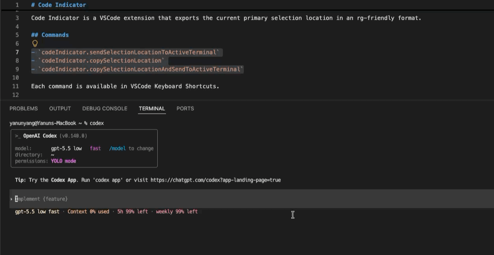

# Code Indicator

[](README.md)
[](README-tw.md)
[](README-cn.md)

Code Indicator 是專為 Codex、Claude Code、OpenCode 這類 CLI coding agent 設計的 VS Code extension。

它可以複製或傳送目前編輯器中的程式碼位置，格式相容 `rg`，讓你能快速把精準的檔案、行、欄位或選取範圍交給 agent 檢查或修改。

<a href="."></a>

## 為什麼需要

CLI coding agent 收到精準的 code location 時，工作效果最好。你不用手動輸入路徑和行號，只要選取程式碼、按右鍵，就能直接把位置送到 terminal。

沒有選取文字時，Code Indicator 會使用游標位置。

## Commands

- `codeIndicator.copySelectionLocation`
- `codeIndicator.sendSelectionLocationToActiveTerminal`
- `codeIndicator.copySelectionLocationAndSendToActiveTerminal`

每個 command 都可以從 Command Palette、editor context menu，以及 VS Code Keyboard Shortcuts 使用。

## Settings

editor context menu 的項目可以個別顯示或隱藏。傳送到 terminal 後自動 focus terminal 的功能預設開啟。

```json
{
  "codeIndicator.contextMenu.copyLocation": true,
  "codeIndicator.contextMenu.sendLocationToTerminal": true,
  "codeIndicator.contextMenu.copyAndSendLocationToTerminal": true,
  "codeIndicator.terminal.focusAfterSend": true
}
```

## Output Format

```text
relative/path.ext:startLine:startColumn-endLine:endColumn
```

位置是 1-based。結束位置使用 VS Code 的 exclusive selection end。

範例：

```text
src/extension.ts:10:3-12:18
src/extension.ts:10:3-10:3
```

路徑會相對於所在的 workspace folder。workspace 外的檔案會使用絕對路徑。

## 授權

MIT
