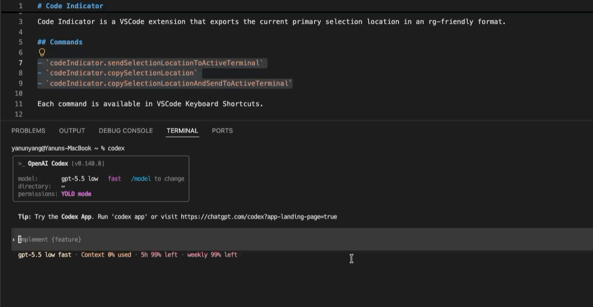

# Code Indicator

[](README.md)
[](README-tw.md)
[](README-cn.md)

Code Indicator is a VS Code extension built for CLI coding agents such as Codex, Claude Code, and OpenCode.

It copies or sends the current editor location in an `rg`-friendly format, so you can quickly point an agent at the exact file, line, column, or selected range you want it to inspect or change.

<a href="."></a>

## Why

CLI coding agents work best when they receive precise code locations. Instead of manually typing paths and line numbers, Code Indicator lets you select code, right-click, and send the location directly to your terminal.

When no text is selected, Code Indicator uses the cursor position.

## Commands

- `codeIndicator.copySelectionLocation`
- `codeIndicator.sendSelectionLocationToActiveTerminal`
- `codeIndicator.copySelectionLocationAndSendToActiveTerminal`
- `codeIndicator.toggleView`
- `codeIndicator.spawnTerminal`
- `codeIndicator.killTerminal`
- `codeIndicator.restartTerminal`
- `codeIndicator.openSettings`

Each command is available from the Command Palette, editor context menu, and VS Code Keyboard Shortcuts.

## Embedded Terminal

Code Indicator includes an activity bar view with an embedded terminal. Sending a location starts the embedded terminal when it is available, focuses it, and writes the location using the configured trailing character.

The view toolbar can spawn, kill, restart, or open settings for the Code Indicator terminal. Killing the terminal keeps the view open and clears the stopped session output.

## Image Paste

Paste an image into the embedded terminal. Code Indicator saves the image in `.tmp/images` under the first workspace folder. Code Indicator creates the directory when necessary. The file name is the current Unix timestamp in milliseconds.

After saving the image, Code Indicator inserts a Markdown image link. Code Indicator does not add a leading space. `codeIndicator.terminal.trailingCharacter` controls the suffix. The default `space` setting produces this text:

```text
[image](./.tmp/images/1786423812345.png)<space>
```

The `newline` setting submits the terminal input after Code Indicator inserts the link.

Code Indicator supports PNG, JPEG, GIF, WebP, BMP, AVIF, TIFF, and SVG images. The image size limit is 20 MB.

## Settings

Settings are grouped into Terminal, Image Paste, and Context Menu. The terminal startup command is optional and runs when the Code Indicator terminal is spawned, reloaded, or auto-started by opening the view. Terminal focus after sending is enabled by default. The trailing character after a location or pasted image link defaults to a space. The editor context menu items can be shown or hidden individually.

To use another image directory, enable `codeIndicator.useCustomImageDirectory` and set `codeIndicator.customImageDirectory`. Use an absolute path or a path relative to the first workspace folder. If the value is empty or the directory cannot be used, Code Indicator uses `.tmp/images` under the first workspace folder.

Image links use relative paths for files inside the first workspace folder. Image links use absolute paths for files outside the first workspace folder.

```json
{
  "codeIndicator.terminal.startupCommand": "",
  "codeIndicator.terminal.focusAfterSend": true,
  "codeIndicator.terminal.trailingCharacter": "space",
  "codeIndicator.useCustomImageDirectory": false,
  "codeIndicator.customImageDirectory": "",
  "codeIndicator.contextMenu.copyLocation": true,
  "codeIndicator.contextMenu.sendLocationToTerminal": true,
  "codeIndicator.contextMenu.copyAndSendLocationToTerminal": true
}
```

`codeIndicator.terminal.trailingCharacter` accepts `space` or `newline`. This setting applies to sent locations and pasted image links.

## Output Format

```text
relative/path.ext:startLine:startColumn-endLine:endColumn
```

Positions are 1-based. The end position uses VS Code's exclusive selection end.

Examples:

```text
src/extension.ts:10:3-12:18
src/extension.ts:10:3-10:3
```

Paths are relative to the containing workspace folder. Files outside the workspace use absolute paths.

## License

MIT
